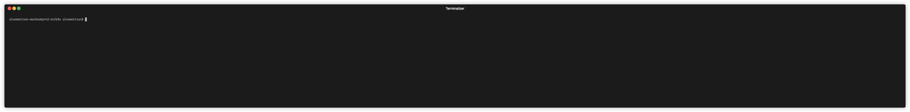

# kn2k8s

command line tool for converting Cloud Run revisions to Kubernetes primitives and apply to the current kube context.

it will read a YAML file as input - example:

```
revisions:
- revision_id: hola-00001-tof
  region: us-central1
  project_id: am-arg-01
- revision_id: hello-00005-qud
  region: us-central1
  project_id: am-arg-01
```

It'll create a namespace, deployment, service account, service account, HPA, HTTPRoute, etc based on the source revision info.

This requires that the cluster has a gateway api controller installed.

>NOTE: because this tool uses the *service* name of a given revision, supplying multiple revisions from the same service will result in subsequent revisions overwriting previous ones



### USAGE

first start by applying the gateway resources

```
kubectl apply -f gateway/
```

>NOTE: if you're using your own gateway setup, make sure you pass the name of the gateway object and the namespace the gateway object is in via `--gatewayName` and `--gatewayNamespace` respectively

Then run, after populating your manifest file with your revision details (revision id, region, and project id)

```
go run . --manifestFile manifest.yaml
```

get help

```
go run . --help
```

### OUTPUT

```
$ go run . --manifestFile manifest.yaml
Reading manifest file manifest.yaml

Processing revision hola-00001-tof of service hola
 100% [==================================================]         
Processing revision hello-00005-qud of service hello
 100% [==================================================]         
Results:
+---------+-----------------+----------------------------------------------------------------------------------------------------------------------------------+-----+--------+--------+
| SERVICE | REVISION        | IMAGE                                                                                                                            | CPU | MEMORY | PATH   |
+---------+-----------------+----------------------------------------------------------------------------------------------------------------------------------+-----+--------+--------+
| hola    | hola-00001-tof  | us-docker.pkg.dev/cloudrun/container/hello@sha256:717e538e1ef8f955a54834e213d080bde6a8b3513fcc406df0d5d5ed3ed2853b               | 1   | 512Mi  | /hola  |
+---------+-----------------+----------------------------------------------------------------------------------------------------------------------------------+-----+--------+--------+
| hello   | hello-00005-qud | us-docker.pkg.dev/google-samples/containers/gke/whereami@sha256:9957f5ff3096a83bae4e0952faaebcac740557e7fb2a642ed38bf5cb64c45795 | 1   | 512Mi  | /hello |
+---------+-----------------+----------------------------------------------------------------------------------------------------------------------------------+-----+--------+--------+
```